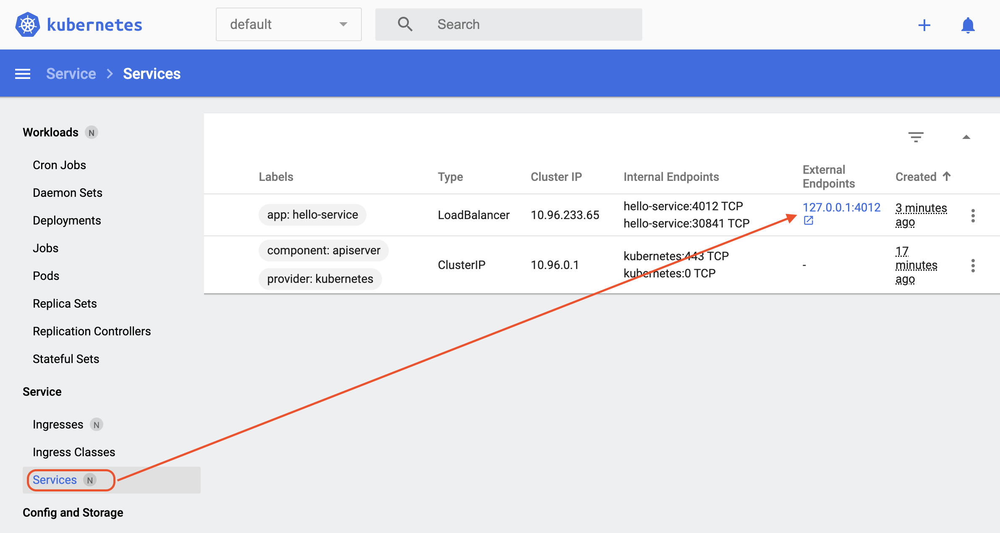

# K8S HelloWorld
- Build the project to get the .jar file
- Create a docker image and push it to dockerhub
- Deploy the image on GKE
- Testing spring app from localhost [http://localhost:8080/](http://localhost:8080/)
- Testing with Docker with port defines with -p option
   ```shell
   docker run --publish 5005:8080 -t nitinkc/k8s-helloworld:k8s-helloworld-latest
   ```
  - [http://localhost:5005/](http://localhost:5005/)
- Testing with minikube
   ```shell
   kubectl create deployment hello-service --image=nitinkc/k8s-helloworld
   kubectl expose deployment hello-service --type=LoadBalancer --port=4012 --target-port=8080
   kubectl scale deployment hello-service  --replicas=5
   minikube tunnel
   ```
  - [http://localhost:4012/](http://localhost:4012/)

# Build & Push Docker image
1. Create Repository on https://hub.docker.com/<repo-name>

Navigate to the directory containing the docker file
```shell
docker build -t nitinkc/k8s-helloworld:v3 .

# Check the image
docker images
```

Tag the image for docker hub
```shell
docker tag 6762c6bb9288 nitinkc/k8s-helloworld:k8s-hw-v3
# Or
docker tag nitinkc/k8s-helloworld:v3  nitinkc/k8s-helloworld:k8s-hw-v3
```

2. Log into the Docker Hub from the command lin3
   ```shell
    docker login --username=nitinkc 
    docker login --username=nitinkc --email=gs.nitin@gmail.com
   ```
push the image to docker hub
```shell
docker login --username=nitinkc 
docker push nitinkc/k8s-helloworld:k8s-hw-v3 
```

Pull the image to ensure its there on docker hub
```shell
docker pull nitinkc/k8s-helloworld:k8s-hw-v3
```

Run the image to test locally
```shell
docker run -p 5005:8080 -t nitinkc/k8s-helloworld:k8s-hw-v3
```

##### Example
```shell
docker login --username=nitinkc
#Should be run in the directory where Dockerfile is present, v3 is the local tag
docker build -t nitinkc/k8s-helloworld:v3 .
docker images
# Tag by either image id or the tag
docker tag 6762c6bb9288 nitinkc/k8s-helloworld:k8s-hw-v3
docker tag nitinkc/k8s-helloworld:v3  nitinkc/k8s-helloworld:k8s-hw-v3

docker push nitinkc/k8s-helloworld:k8s-hw-v3 
docker pull nitinkc/k8s-helloworld:k8s-hw-v3

docker run -p 5005:8080 -t nitinkc/k8s-helloworld:k8s-hw-v3
```

Testing with Docker with port defines with -p option

```shell
docker run --publish 5005:8080 -t nitinkc/k8s-helloworld:k8s-helloworld-latest
```
[http://localhost:5005/](http://localhost:5005/)

### Important Docker Commands

```sh
# To list all running Docker containers
docker ps --all

# List all containers, both running and stopped
sudo docker ps -a
sudo docker ps -aq #quiet

docker system prune

# Show all containers
# Remove Containers
docker container rm 6d0806087e50
docker container rm 8cf7ae980534

docker system prune
docker ps -l
```

# DockerHub Automated Builds
[Configure automated builds here](https://docs.docker.com/docker-hub/builds/)

# Testing with minikube

Start the minikube cluster
```shell
minikube start
```

Start the dashboard to watch from the GUI
```shell
minikube dashboard
```

Create the deployment and deploy a service
```shell
kubectl create deployment hello-service --image=nitinkc/k8s-helloworld:k8s-hw-v3
kubectl expose deployment hello-service --type=LoadBalancer --port=4012 --target-port=8080
```

Start a tunnel to test the service
```shell
#Starting tunnel for service hello-service.
minikube tunnel
```

test service
[http://localhost:4012/](http://localhost:4012/)



# Manually Deploy the Springboot app on GKE Cluster

Springboot application runs on port 5000(resources.yaml). Load balancer should allow only port 8080

Note: for GCR we need image name as ' --image=gcr.io/my-project/k8s-helloworld:v1'

## API's

<app_name>:<port_number>/

<app_name>:<port_number>/hello-world

<app_name>:<port_number>/actuator

<app_name>:<port_number>/actuator/health